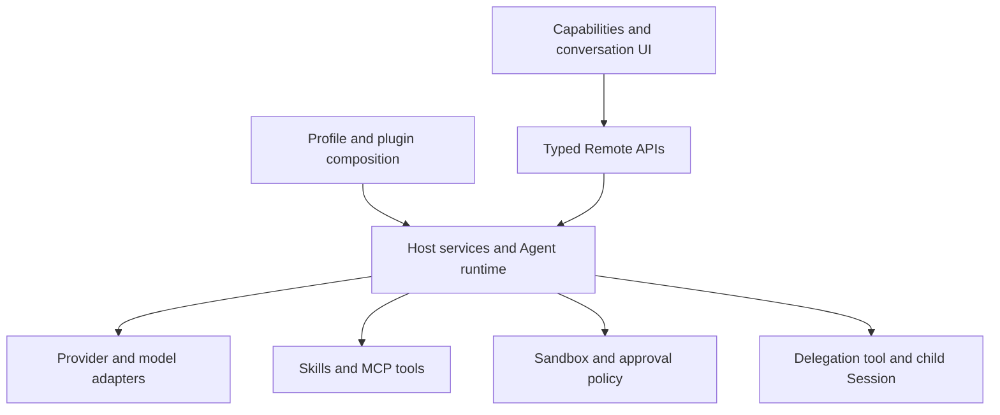

# agent base

English | [中文](README.zh.md)

agent base is a reusable Agent workspace derived from [DeepSeek Harness](https://github.com/deepseek-ai/deepseek-harness), maintained in [chenkven/agent](https://github.com/chenkven/agent). Its capability center connects existing runtime services to permission, model, Skill, MCP, Prompt, and multi-Agent management pages.

## Capabilities

| Requirement | Product entry | Behavior |
|---|---|---|
| Permissions | Capabilities → Permissions | Inspect and switch the selected Session's sandbox and approval preset; writes use the existing permission command. |
| Providers and models | Capabilities → Models; Settings → Models | Configure providers and credentials through one shared editor; conversations and role forms use the Host model catalog. |
| Skill | Capabilities → Skill | Inspect source and invocation flags; edit flags for project-owned Skill files. |
| MCP | Capabilities → MCP | Add, edit, remove, enable, and disable profile connections using HTTP or stdio. |
| Prompt | Capabilities → Prompt | Inspect Agent preset compositions and choose the preset for new Sessions. |
| Multiple Agents | Capabilities → Multi-Agent | Persist role persona, model route, and global-tool allowlist; submit delegation requests and open durable child conversations. |
| Reuse | Profiles and plugins | Compose providers, tools, skills, presets, and subagent backends without modifying the core Agent loop. |

<a id="run"></a>

<a id="run-from-source"></a>
## Run from source

Use a Node version supported by `package.json` and pnpm **11.7.0**; this checkout is verified with system Node **24.19.0**. From a writable project directory:

```sh
git clone --branch chen_dsh_demo_261004 https://github.com/chenkven/agent.git
cd agent
pnpm install --ignore-scripts
pnpm run build
pnpm run agent-base web
```

Open the complete URL printed by the launcher, including its authentication parameter. Configure a valid API Key in **Capabilities → Models**, select an available model in the conversation, and send a task. Without a valid credential, pages can be inspected but model calls fail. `pnpm run dsh web` remains a compatibility command. See the [mentor demo tutorial](docs/user/guide/mentor-demo.md) and [Web guide](docs/user/guide/index.md).

## Reuse and architecture

Profiles select ordered plugin compositions. Host services validate and persist configuration, while browser plugins expose data and actions through typed Remotes and slots. The main Agent can invoke configured delegation tools, each of which creates its own child context and persisted Session.



The [architecture reference](docs/architecture.md) owns runtime composition. [Capability center](packages/client/ui-plugin-manager/README.md), [profile management](packages/boot/plugin-manager/README.md), [Models editor](packages/client/ui-settings-models/README.md), and [delegation tools](packages/subagent/tool-subagent/README.md) document their extension contracts.

## Delivery boundaries

Permissions govern Agent operations through sandbox and approval policy; this is not account RBAC or a production tenant service. Roles and MCP edits affect the current Profile's Sessions. Delegated children inherit the parent sandbox scope and use `never` approval; blocked operations cannot ask for broader access. Multi-Agent provides named role delegation and conversation records, without a visual workflow graph. Skill authoring and Prompt text editing remain file-based. Realtime answering requires a valid model credential and a running Host.

Local demo gateway files and keys under `.artifacts/` are excluded from Git. A public deployment needs an authenticated gateway and a separate runtime or equivalent isolation per visitor; a port mapping alone does not supply these controls. See the [demo tutorial](docs/user/guide/mentor-demo.md#remote-access).

## Upstream and license

This project reuses the DeepSeek Harness runtime and retains its internal package names, configuration names, and `dsh` compatibility command. Product identity and the `agent-base` alias are owned by this fork. The code is distributed under the [MIT license](LICENSE); upstream attribution and [third-party notices](THIRD_PARTY_NOTICES.md) remain intact.
