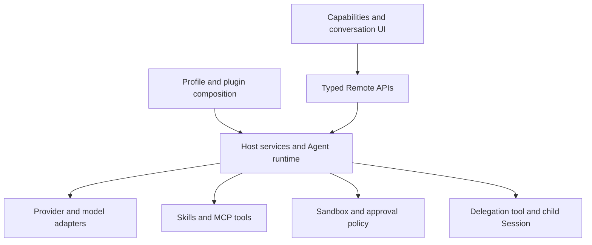

# agent base

[English](README.md) | 中文

agent base 是基于 [DeepSeek Harness](https://github.com/deepseek-ai/deepseek-harness) 改造的可复用 Agent 工作空间，在 [chenkven/agent](https://github.com/chenkven/agent) 独立维护。能力中心将已有运行时服务接入权限、模型、Skill、MCP、Prompt 和多 Agent 管理页面。

## 能力

| 导师要求 | 产品入口 | 实际行为 |
|---|---|---|
| 权限 | 能力中心 → 权限 | 查看和切换所选会话的沙箱、审批预设，写入使用已有权限命令。 |
| 供应商与模型 | 能力中心 → 模型；设置 → 模型 | 共用一个编辑器配置供应商及凭据，聊天和角色表单使用 Host 模型目录。 |
| Skill | 能力中心 → Skill | 查看来源和调用开关，可编辑项目内 Skill 文件的调用开关。 |
| MCP | 能力中心 → MCP | 使用 HTTP 或 stdio 添加、编辑、删除、启用和停用 profile 连接。 |
| Prompt | 能力中心 → Prompt | 查看 Agent 预设组合，选择新会话的默认预设。 |
| 多 Agent | 能力中心 → 多 Agent | 保存角色提示词、模型和全局工具允许列表，提交委派任务，打开持久化子会话。 |
| 可复用 | Profile 与插件 | 组合供应商、工具、Skill、预设及子代理后端，无需修改核心 Agent 循环。 |

<a id="run"></a>

<a id="run-from-source"></a>
## 从源码运行

使用 `package.json` 支持的 Node 版本和 pnpm **11.7.0**；本项目已使用系统 Node **24.19.0** 验证。在可写的项目目录中执行：

```sh
git clone --branch chen_dsh_demo_261004 https://github.com/chenkven/agent.git
cd agent
pnpm install --ignore-scripts
pnpm run build
pnpm run agent-base web
```

打开启动器打印的完整网址，保留身份验证参数。在**能力中心 → 模型**配置有效 API Key，再在聊天中选择可用模型并发送任务。没有有效凭据时可以浏览页面，但模型调用会失败。`pnpm run dsh web` 保留为兼容命令。参见[导师演示教程](docs/user/guide/mentor-demo.zh.md)和 [Web 指南](docs/user/guide/index.zh.md)。

## 复用与架构

Profile 选择按顺序组合的插件。Host 服务校验并保存配置，浏览器插件通过有类型的 Remote 与插槽暴露数据和动作。主 Agent 可以调用配置好的委派工具，每次委派创建独立的子代理上下文和持久化会话。



[架构参考](docs/architecture.zh.md)说明运行时组合。[能力中心](packages/client/ui-plugin-manager/README.zh.md)、[profile 管理](packages/boot/plugin-manager/README.zh.md)、[模型编辑器](packages/client/ui-settings-models/README.zh.md)和[委派工具](packages/subagent/tool-subagent/README.zh.md)说明各自的扩展约定。

## 交付边界

权限通过沙箱和审批策略约束 Agent 操作，不是账户 RBAC 或生产租户服务。角色与 MCP 编辑影响当前 Profile 的会话。子代理继承父会话沙箱范围，审批固定为 `never`，被阻止的操作不能申请更大权限。多 Agent 提供命名角色委派和会话记录，不包含可视化流程图。Skill 编写和 Prompt 文本编辑仍使用文件。实时回答需要有效模型凭据和持续运行的 Host。

`.artifacts/` 中的本机演示网关文件和密钥不进入 Git。公网部署需要经过认证的网关，以及每位访问者独立的运行时或同等隔离措施；端口映射本身不提供这些控制。参见[演示教程](docs/user/guide/mentor-demo.zh.md#remote-access)。

## 上游与许可

本项目复用 DeepSeek Harness 运行时，保留内部包名、配置名称和 `dsh` 兼容命令。产品身份及 `agent-base` 别名由本项目维护。代码使用 [MIT 许可证](LICENSE)，保留上游署名与[第三方依赖声明](THIRD_PARTY_NOTICES.md)。
